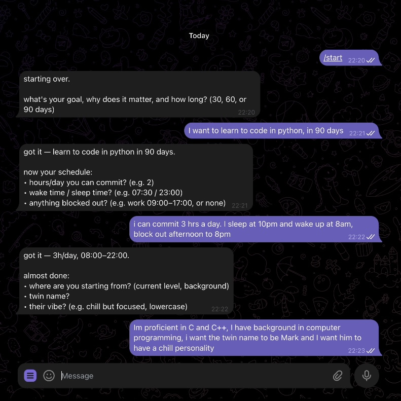
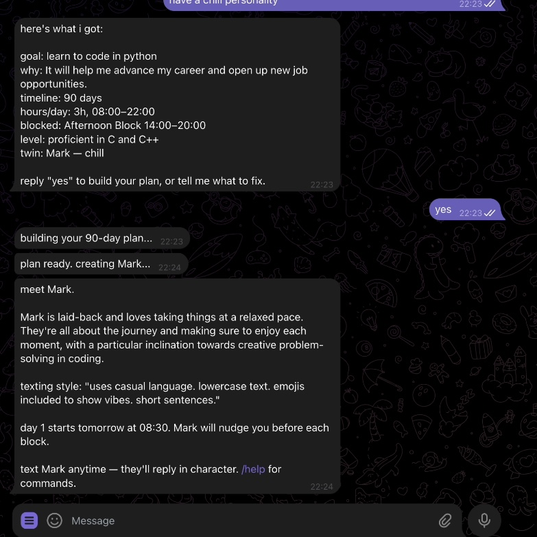
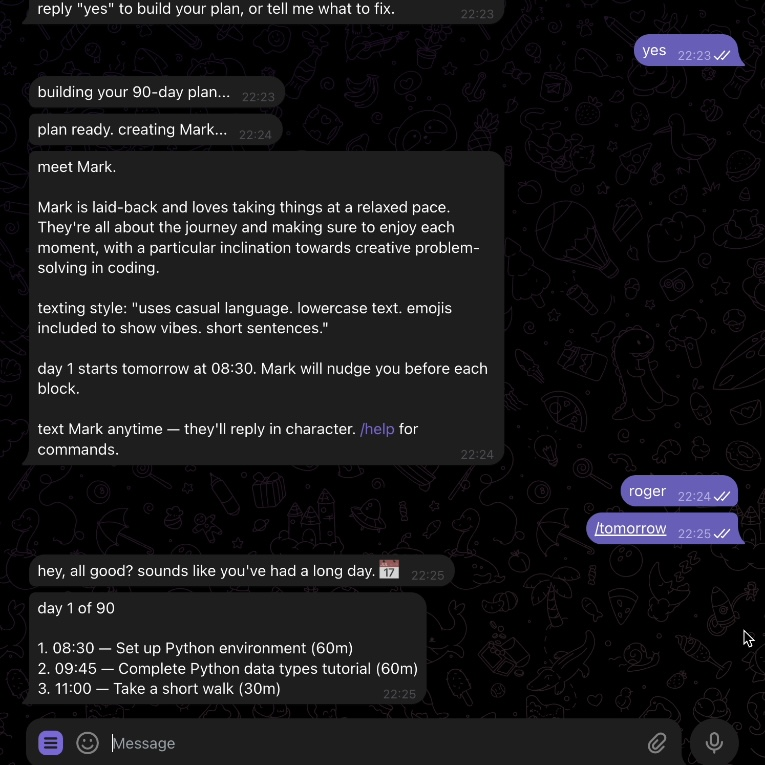

# Echo Twin

> A digital-twin accountability app. You set a goal; your "twin" — a fictional peer pursuing the same plan, slightly ahead — texts you on Telegram throughout the day about what they're working on, in first person. Parasocial accountability instead of nagging notifications.

---

## Overview

### Problem

Students and self-directed learners pursuing multi-week goals (DSA prep, fitness, language learning) consistently fail around day 10-15 of a long plan. Existing tools fall into two buckets:

1. **Reminder apps** — push notifications that are easy to dismiss because there's no one on the other end
2. **AI coaches** — feel preachy, obviously a bot, create fatigue

What's missing: the feeling of a friend doing the same thing. People stick with gym routines when they have a workout buddy. Echo Twin reproduces that social parallel pressure — synthetically.

### What was built

- User onboards via Telegram in 3 messages (goal → schedule → twin setup)
- GPT-4o generates a 30/60/90-day plan as weekly templates with progressive difficulty
- A fictional "twin" is generated with a name, personality, and speech style
- The twin texts the user 3 times per block: 10 min before, at start, and at end
- A morning briefing arrives at the user's wake time with a casual overview of the day
- The user can reply to the twin anytime; twin responds in character
- Slash commands: `/today`, `/done`, `/streak`, `/twin`, `/plan`, `/reset`

---

## Demo

[90-second demo video](./assets/demo.mp4)

**Screenshots:**

| Onboarding | Confirmation + Generation | Twin intro + Commands |
|---|---|---|
|  |  |  |

---

## Technology Stack

### Backend
- **Next.js 15** (App Router, TypeScript) — API server only, no web UI
- **Prisma 7** with **SQLite** via `better-sqlite3` adapter — single local database
- **OpenAI SDK** — `gpt-4o` for plan + twin generation (structured outputs via Zod), `gpt-4o-mini` for nudges and replies

### Messaging
- **Telegram Bot API** — direct HTTP calls, no third-party library
- **macOS LaunchAgent** — polls Telegram every 10 seconds, triggers the Next.js server

### Validation
- **Zod** — schema validation for LLM structured outputs and request bodies

---

## Development Approach with AI

### Tools used

| Tool | Purpose |
|---|---|
| **Claude Code** | Primary co-developer. Wrote all application code, made architectural decisions, debugged integrations |
| **OpenAI gpt-4o** | Runtime: plan generation, twin generation, onboarding parsing |
| **OpenAI gpt-4o-mini** | Runtime: nudge messages, conversational replies, per-step onboarding validation |

### Key architectural decisions

| Decision | Options | Chosen | Why |
|---|---|---|---|
| Interface | Web app + Telegram | Telegram-only | The core UX is receiving texts — a web UI adds friction without value |
| Messaging layer | OpenClaw vs direct API | Direct Telegram Bot API | OpenClaw's AI agent had an irrecoverable API incompatibility with OpenAI |
| Scheduling | External cron vs inline polling | Inline polling | Polling every 10s is negligible overhead and eliminates external dependencies |
| Plan generation | Single large prompt vs weekly templates | Weekly templates | Single prompts truncated for 90-day plans; weekly is reliable and adds natural progression |

### Key prompts

All prompts are in `src/lib/prompts.ts` and documented in `docs/prompts.md`. The four critical ones:

1. **`WEEK_TEMPLATE_PROMPT`** — generates a 7-day block schedule at a given difficulty level
2. **`TWIN_GENERATION_PROMPT`** — creates personality, speech style, and parallel schedule for the twin
3. **`NUDGE_*_PROMPT`** (pre/during/post) — three distinct nudge types per block, each from the twin's perspective
4. **`REPLY_PROMPT`** — keeps the twin in character during conversation

### What failed and what we learned

- **OpenClaw integration failed** — the agent used a non-standard tool type (`custom`) that OpenAI rejects. Replaced with direct API calls after ~2 hours debugging. Lesson: verify third-party agent compatibility before committing.
- **Plan truncation** — single prompt for 90-day plans hit token limits mid-JSON. Fixed by generating weekly templates and expanding them.
- **Gender-neutral pronouns** — GPT defaulted to "she/her" regardless of twin name. Required explicit instruction in the system prompt.

---

## Installation

### Prerequisites

- **macOS** (the polling daemon uses launchd — see Limitations for non-macOS)
- **Node.js 22+** — check with `node -v`
- **A Telegram account**
- **An OpenAI API key** — [get one here](https://platform.openai.com/api-keys)

### Step 1 — Create your Telegram bot

1. Open Telegram, search for **@BotFather**, send `/newbot`
2. Pick a display name (e.g. "Echo Twin") and a username ending in `_bot`
3. Copy the token BotFather gives you — looks like `1234567890:ABCdef...`

### Step 2 — Get your Telegram user ID

You'll need this so the bot knows who to message.

1. Search Telegram for **@userinfobot** and send it any message
2. It replies with your user ID (a number like `805422072`)

### Step 3 — Configure environment

```bash
git clone https://github.com/lnulhak/twin_bot.git
cd twin_bot
cp .env.example .env.local
```

Edit `.env.local` and fill in:

```
DATABASE_URL="file:./echo-twin.db"
OPENAI_API_KEY="sk-..."              # your OpenAI key
TELEGRAM_BOT_TOKEN="1234567890:..."  # from BotFather
TELEGRAM_CHAT_ID="805422072"         # your Telegram user ID
```

### Step 4 — Run setup

```bash
bash scripts/setup.sh
```

This script:
- Checks Node version
- Installs npm dependencies
- Runs database migrations
- Registers slash commands with Telegram
- Installs the polling LaunchAgent (macOS only)

If `.env.local` is incomplete, the script will tell you what's missing and exit.

### Step 5 — Start the app

```bash
npm run dev
```

Send **`/start`** to your Telegram bot. Onboarding takes ~3 messages and ~30 seconds to generate.

### Resetting (start fresh)

```bash
bash scripts/dev-reset.sh
```

---

## Limitations

> These are known constraints of the current MVP. They are intentional trade-offs for a 6-hour proof of concept, not bugs.

**macOS only (polling daemon)**
The background polling loop uses macOS `launchd`. On Linux or Windows, the poller won't auto-start. You can simulate it manually:
```bash
# Linux/Windows: run this in a loop yourself
while true; do curl -s -X POST http://localhost:3000/api/telegram/poll; sleep 10; done
```

**Laptop must be on**
The app runs locally. If your Mac sleeps or loses internet, nudges won't fire and the bot won't respond. For always-on use, deploy to a server (Vercel + Turso, or a VPS).

**Single user**
The database stores one user (id=1). Multi-user support would require authentication and a hosted database — out of scope for this prototype.

**Reply delay up to 10 seconds**
Telegram messages are polled every 10 seconds, not event-driven. Replies arrive within 10 seconds of the user's message. For instant replies, a webhook + public URL (ngrok, Cloudflare Tunnel, or deployment) is needed.

**OpenAI API costs**
- Plan generation: ~$0.10–0.20 per onboarding (90-day plan, gpt-4o)
- Nudges and replies: ~$0.001–0.002 each (gpt-4o-mini)
- Typical daily cost for an active user: <$0.05

**Twin memory resets daily**
The twin doesn't remember what happened yesterday. Each nudge and reply is generated with only the last 6–10 messages as context. Persistent memory across days is a planned feature.

**Timezone is hardcoded to SGT (Asia/Singapore)**
All block timing and nudge firing uses Singapore time. Changing timezone requires updating `TIMEZONE` in `src/app/api/telegram/poll/route.ts`.

---

## Usage

**Onboard once:** Send `/start` to your bot. Answer 3 short messages (goal → schedule → twin). Review the parsed summary. Reply "yes". Wait ~30 seconds for generation.

**Daily flow:**
- At your wake time → morning briefing from your twin
- 10 min before each block → pre-nudge ("about to start X")
- At block start → during-nudge ("just started X")
- At block end → post-nudge ("just finished, how'd it go")
- Text the bot anytime → twin replies in character

**Slash commands:**

| Command | What it does |
|---|---|
| `/today` | Today's blocks with completion status |
| `/tomorrow` | Tomorrow's blocks (preview) |
| `/done 2` | Mark block 2 complete (only after it starts) |
| `/streak` | Current streak — requires ALL blocks done |
| `/twin` | What your twin is doing right now |
| `/plan` | This week's overview with days left |
| `/reset` | Wipe everything and start a new goal |
| `/help` | All commands |

---

## Project Structure

```
twin_bot/
├── src/
│   ├── app/
│   │   ├── api/telegram/poll/   ← main handler: commands, nudges, onboarding
│   │   └── page.tsx             ← minimal status page
│   └── lib/
│       ├── db.ts                ← Prisma singleton
│       ├── llm.ts               ← OpenAI wrappers
│       ├── prompts.ts           ← all prompt templates
│       ├── telegram.ts          ← Telegram Bot API wrapper
│       ├── onboardingSession.ts ← multi-step onboarding state
│       └── types.ts             ← shared TypeScript types
├── prisma/schema.prisma         ← data model
├── tests/                       ← vitest smoke tests
├── docs/                        ← architecture, dev log, prompts
├── scripts/                     ← dev-reset, set-bot-commands, telegram-poll
└── data/sample-onboarding.json  ← example input for testing
```

---

## Reflection

### What worked

- **Telegram-native** was the right call. Removing the web UI simplified everything and focused the product on what it actually is: a texting experience.
- **Weekly template approach** for plan generation solved the token truncation problem and gave natural weekly progression for free.
- **3-step onboarding with confirmation** dramatically improved the experience — users see what GPT parsed before committing to the 30s generation wait.

### What failed

- **OpenClaw** took longer to debug than building the replacement. For a time-boxed build, integrating active-development third-party tooling is risky.
- **Gender-neutral pronouns** need explicit prompting — GPT defaults to gendered language without instruction.

### What's next

- Multi-user support (requires auth and a hosted DB)
- Voice notes from the twin
- Persistent twin memory across days
- Deploy so the app works when your laptop is closed

---

## License

MIT — see `LICENSE`

```bash
npm run dev
# or
yarn dev
# or
pnpm dev
# or
bun dev
```

Open [http://localhost:3000](http://localhost:3000) with your browser to see the result.

You can start editing the page by modifying `app/page.tsx`. The page auto-updates as you edit the file.

This project uses [`next/font`](https://nextjs.org/docs/app/building-your-application/optimizing/fonts) to automatically optimize and load [Geist](https://vercel.com/font), a new font family for Vercel.

## Learn More

To learn more about Next.js, take a look at the following resources:

- [Next.js Documentation](https://nextjs.org/docs) - learn about Next.js features and API.
- [Learn Next.js](https://nextjs.org/learn) - an interactive Next.js tutorial.

You can check out [the Next.js GitHub repository](https://github.com/vercel/next.js) - your feedback and contributions are welcome!

## Deploy on Vercel

The easiest way to deploy your Next.js app is to use the [Vercel Platform](https://vercel.com/new?utm_medium=default-template&filter=next.js&utm_source=create-next-app&utm_campaign=create-next-app-readme) from the creators of Next.js.

Check out our [Next.js deployment documentation](https://nextjs.org/docs/app/building-your-application/deploying) for more details.
